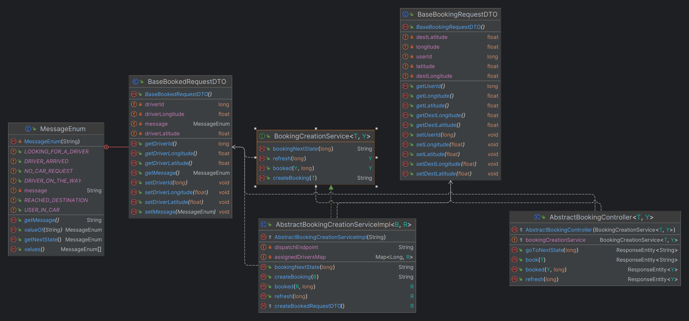

# Framework's Booking service

This service is supposed to Handle bookings made by users, manage assignments, states of the user, and assigned driver's location.

# Table of Contents

- [Provided Classes](#classes-provided-by-the-framework)
  - [Service Methods](#service-methods)
  - [Controller Endpoints](#controller-endpoints)
- [Constructors](#constructors)
  - [Controllers](#controllers)
  - [Services](#services)

# Classes provided by the framework

The provided baseline DTOs are supposed to be expanded upon. As such the provided logic and controllers are written using generics.

  
   Classes provided by the framework for booking service.

## Service methods

The logic provided by the framework for the booking service.

|         Method         |                              Logic                               |
|:----------------------:|:----------------------------------------------------------------:|
|     createBooking      |           Logic for creating a booking from the user.            |
|         booked         |          Logic for when the user is booked by a driver.          |
|        refresh         |        Logic for user to refresh and see if he is booked.        |
|    bookingNextState    |    Logic for driver to progress the travel state to the next     |
| createBookedRequestDTO | Method to be overwritten by user to return the new extended DTO. |

## Controller endpoints

The exposed endpoints provided by the framework for the booking service.

| HTTP Verb |    Exposed Endpoint    |                                      Job                                       |
|:---------:|:----------------------:|:------------------------------------------------------------------------------:|
|   POST    |         /book          | Start a booking and sends a request to dispatch to start the finding process.  |
|     -     | Service Communications |                Assigns the driver found by dispatch to a user.                 |
|    GET    |   /refresh/{userID}    | Returns the current state of the driver assignment and their location to user. |
|   PATCH   |  /nextstate/{userID}   |                Goes to the next state of user's travel states.                 |

# Constructors

The constructors required to be called when **extending** from the framework are as follows:

## Controllers

The constructors for framework controllers.

|        Controller         |                        Constructor                         |                                                     Input(s)                                                     |
|:-------------------------:|:----------------------------------------------------------:|:----------------------------------------------------------------------------------------------------------------:|
| AbstractBookingController | super(BookingCreationService<T, Y> bookingCreationService) | A booking creation service that implements BookingCreationService or extends AbstractBookingCreationServiceImpl. |

## Services

The constructors for framework services.

|              Services              |          Constructor           |                            Input(s)                             |
| :--------------------------------: | :----------------------------: | :-------------------------------------------------------------: |
| AbstractBookingCreationServiceImpl | super(String dispatchEndpoint) | A string that points to where the dispatch endpoint is located. |

