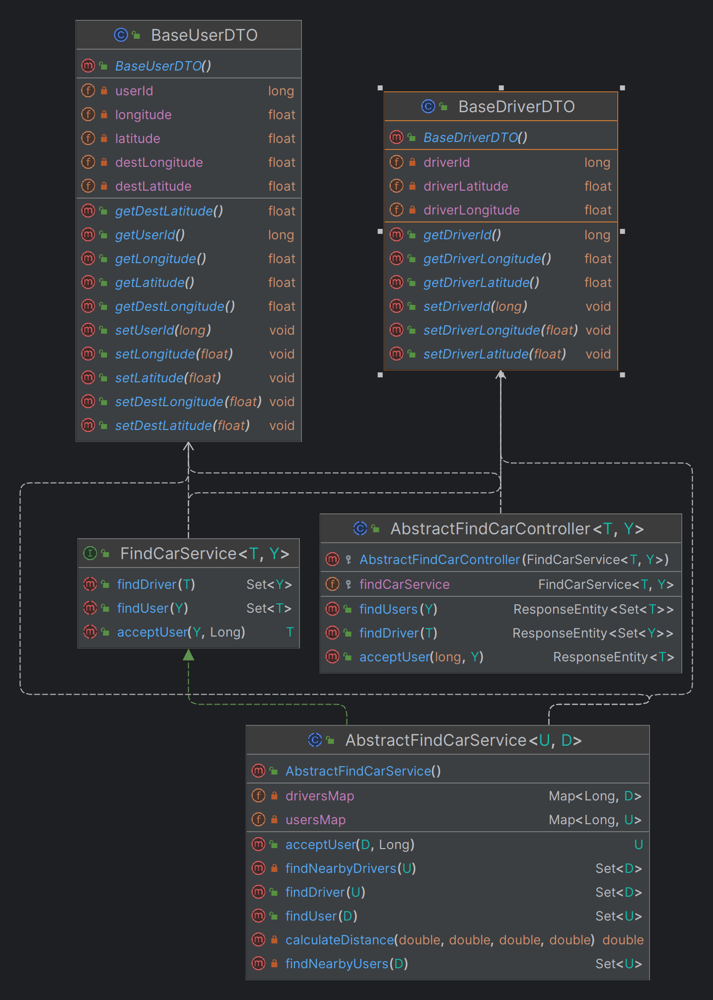

# Framework's Dispatch service

This service is supposed to Handle bookings made by users, manage assignments, states of the user, and assigned driver's location.

# Table of Contents

- [Provided Classes](#classes-provided-by-the-framework)
  - [Service Methods](#service-methods)
  - [Controller Endpoints](#controller-endpoints)
- [Constructors](#constructors)
  - [Controllers](#controllers)
  - [Services](#services)

# Classes provided by the framework

The provided baseline DTOs are supposed to be expanded upon. As such the provided logic and controllers are written using generics.

  
   Classes provided by the framework for booking service.

## Service methods

The logic provided by the framework for the dispatch service.

|         Method         |                              Logic                               |
|:----------------------:|:----------------------------------------------------------------:|
|       findDriver       |        Logic for sending the user to all nearby drivers.         |
|        findUser        |          Logic for sending nearby users to the driver.           |
|       acceptUser       |                Logic for when a user is accepted.                |

## Controller endpoints

The exposed endpoints provided by the framework for the dispatch service.

| HTTP Verb |    Exposed Endpoint    |                                                 Job                                                 |
|:---------:|:----------------------:|:---------------------------------------------------------------------------------------------------:|
|     -     | Service Communications |                    When a new user looks for a driver notify all nearby drivers.                    |
|     -     | Service Communications |                       When a driver looks for a user return all nearby users.                       |
|     -     | Service Communications | Calls inside logic for removing drivers and users from the finding job and saving them to database. |

# Constructors

The constructors required to be called when **extending** from the framework are as follows:

## Controllers

The constructors for framework controllers.

|        Controller         |                Constructor                 |                                        Input(s)                                         |
|:-------------------------:|:------------------------------------------:|:---------------------------------------------------------------------------------------:|
| AbstractFindCarController | super(FindCarService<T, Y> findCarService) | A finding car service that implements FindCarService or extends AbstractFindCarService. |

## Services

The constructors for framework services.

|        Services        |                     Constructor                     |                                   Input(s)                                    |
|:----------------------:|:---------------------------------------------------:|:-----------------------------------------------------------------------------:|
| AbstractFindCarService | super(String fleetEndpoint, String bookingEndpoint) | Strings that point to where the dispatch and the fleet endpoints are located. |

