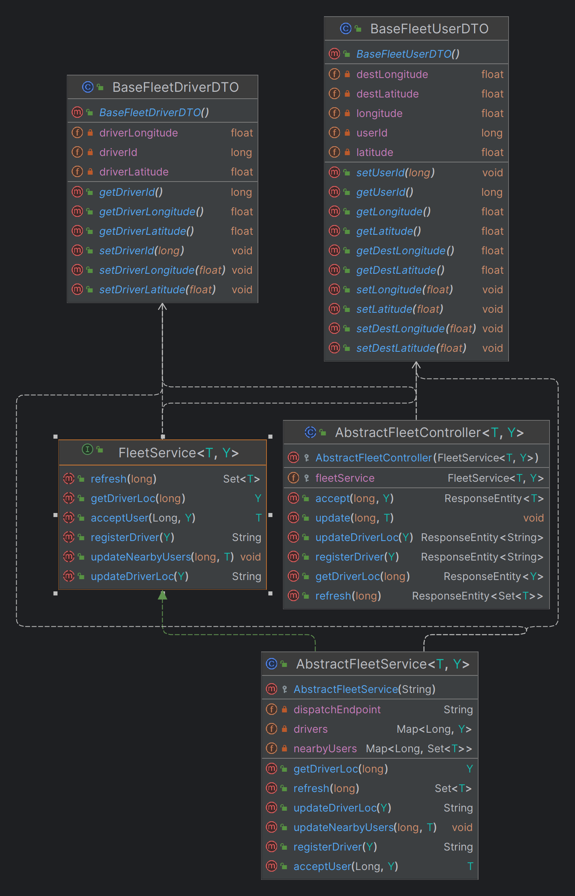

# Framework's Fleet service

This service is supposed to Handle bookings made by users, manage assignments, states of the user, and assigned driver's location.

# Table of Contents

- [Provided Classes](#classes-provided-by-the-framework)
    - [Service Methods](#service-methods)
    - [Controller Endpoints](#controller-endpoints)
- [Constructors](#constructors)
    - [Controllers](#controllers)
    - [Services](#services)

# Classes provided by the framework

The provided baseline DTOs are supposed to be expanded upon. As such the provided logic and controllers are written using generics.

  
   Classes provided by the framework for booking service.

## Service methods

The logic provided by the framework for the fleet service.

|      Method       |                                     Logic                                     |
|:-----------------:|:-----------------------------------------------------------------------------:|
|  registerDriver   |     Logic for when the driver registers himself as searching for a user.      |
|  updateDriverLoc  | Logic for the frontend to update driver location every few kilometers/meters. |
|      refresh      |            Logic for the driver to see which users are around him.            |
|   getDriverLoc    |        Logic for getting driver's current location for other services.        |
|    acceptUser     |        Logic for what happens in this service when a user is accepted.        |
| updateNearbyUsers |  Logic for the dispatch service to update the nearby users for each driver.   |

## Controller endpoints

The exposed endpoints provided by the framework for the fleet service.

| HTTP Verb |    Exposed Endpoint    |              Job              |
|:---------:|:----------------------:|:-----------------------------:|
|   POST    |       /register        |       Register a driver       |
|   POST    |    /location/update    |    Update driver location     |
|     -     | Service Communications | Sends updated driver location |
|    GET    |        /refresh        | Sends updated users to driver |
|   POST    |    /accept/{userId}    |       Accepting a user        |
|     -     | Service Communications | Updates driver's nearby users |

# Constructors

The constructors required to be called when **extending** from the framework are as follows:

## Controllers

The constructors for framework controllers.

|       Controller        |              Constructor               |                                   Input(s)                                    |
|:-----------------------:|:--------------------------------------:|:-----------------------------------------------------------------------------:|
| AbstractFleetController | super(FleetService<T, Y> fleetService) | A fleet service that implements FleetService or extends AbstractFleetService. |

## Services

The constructors for framework services.

|       Services       |          Constructor           |                            Input(s)                             |
|:--------------------:|:------------------------------:|:---------------------------------------------------------------:|
| AbstractFleetService | super(String dispatchEndpoint) | A string that points to where the dispatch endpoint is located. |

